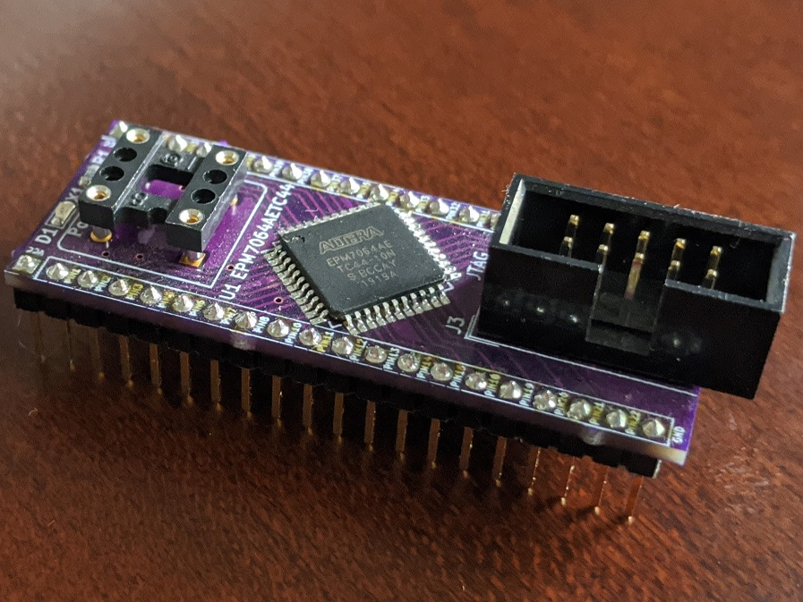

# MAX7 Proto
Prototyping Board for Altera MAX7000 CPLDs

## Table of Content
* [Introduction](#introduction)
* [Hardware Documentation](#hardware-documentation)
  * [Schematic and PCB Layout](#schematic-and-pcb-layout)
  * [Connectors and Jumpers](#connectors-and-jumpers)
  * [Bill of Materials](#bill-of-materials)
* [Programming](#programming)

## Introduction

MAX7 Proto is a prototyping board based on Altera MAX7000 series CPLDs. The board has pin headers on both sides, and it can be easily mounted on a breadboard. It also includes a 3.3V LDO, so that MAX7000AE CPLDs can be used. A DIP-8 oscillator socket is provided for the designs that requre a clock.

## Hardware Documentation

### Schematic and PCB Layout

[Schematic](KiCad/MAX7_Proto-Schematic.pdf)

[PCB Layout](KiCad/MAX7_Proto-Board.pdf)

### Connectors and Jumpers

#### J1, J2 - CPLD Breakout Pin Headers
Pin   | Signal Name | Description               | Pin   | Signal Name | Description
----- | ----------- | ------------------------- | ----- | ----------- | -------------------------
J1-1  | VCC         | Power Supply - +5V        | J2-1  | VCC         | Power Supply - +5V
J1-2  | PIN1_TDI    | CPLD Pin 1; JTAG TDI; I/O | J2-2  | PIN44       | CPLD Pin 44; I/O
J1-3  | PIN2        | CPLD Pin 2; I/O           | J2-3  | PIN43       | CPLD Pin 43; I/O
J1-4  | PIN3        | CPLD Pin 3; I/O           | J2-4  | PIN42       | CPLD Pin 42; I/O
J1-5  | PIN5        | CPLD Pin 5; I/O           | J2-5  | PIN40       | CPLD Pin 40; In, OE2, GCLK2
J1-6  | PIN6        | CPLD Pin 6; I/O           | J2-6  | PIN39       | CPLD Pin 39; In, GCLRn
J1-7  | PIN7_TMS    | CPLD Pin 7; JTAG TMS; I/O | J2-7  | PIN38       | CPLD Pin 38; In, OE1n
J1-8  | PIN8        | CPLD Pin 8; I/O           | J2-8  | PIN37       | CPLD Pin 37; In, GCLK2
J1-9  | PIN10       | CPLD Pin 10; I/O          | J2-9  | PIN35       | CPLD Pin 35; I/O
J1-10 | PIN11       | CPLD Pin 11; I/O          | J2-10 | PIN34       | CPLD Pin 34; I/O
J1-11 | PIN12       | CPLD Pin 12; I/O          | J2-11 | PIN33       | CPLD Pin 33; I/O
J1-12 | PIN13       | CPLD Pin 13; I/O          | J2-12 | PIN32_TDO   | CPLD Pin 32; JTAG TDO; I/O
J1-13 | PIN14       | CPLD Pin 14; I/O          | J2-13 | PIN31       | CPLD Pin 31; I/O
J1-14 | PIN15       | CPLD Pin 15; I/O          | J2-14 | PIN30       | CPLD Pin 30; I/O
J1-15 | PIN18       | CPLD Pin 18; I/O          | J2-15 | PIN28       | CPLD Pin 28; I/O
J1-16 | PIN19       | CPLD Pin 19; I/O          | J2-16 | PIN27       | CPLD Pin 27; I/O
J1-17 | PIN20       | CPLD Pin 20; I/O          | J2-17 | PIN26_TCK   | CPLD Pin 26; JTAG TCK; I/O
J1-18 | PIN21       | CPLD Pin 21; I/O          | J2-18 | PIN25       | CPLD Pin 25; I/O
J1-19 | PIN22       | CPLD Pin 22; I/O          | J2-19 | PIN23       | CPLD Pin 23; I/O
J1-20 | GND         | Ground                    | J2-20 | GND         | Ground

#### J3 - JTAG - CPLD
Pin  | Signal Name | Description      | Pin  | Signal Name | Description
---- | ----------- | ---------------- | ---- | ---------- | ----------------
1    | TCK         | Test Clock       | 2    | GND         | Ground
3    | TDO         | Test Data Output | 4    | 3.3V        | Power Supply - +3.3V
5    | TMS         | Test Mode Select | 6    | PIN2        | No Connect
7    | NC          | No Connect       | 8    | NC          | No Connect
9    | TDI         | Test Data Input  | 10   | GND         | Ground

#### JP1 - LDO Bypass
Solder instead of U2 LDO when using a 5V CPLD

#### JP2 - Oscillator Connect
Solder to connect X1 oscillator to CPLD pin 37 / GCLK1

### Bill of Materials

[MAX7_Proto project on Mouser.com](https://www.mouser.com/ProjectManager/ProjectDetail.aspx?AccessID=f840bea3ac) - View and order all components except of the PCB.

[MAX7_Proto project on OSH Park](https://oshpark.com/shared_projects/AL0pME1G) - View and order the PCB.

Component type     | Reference | Description                                 | Quantity | Possible sources and notes 
------------------ | --------- | ------------------------------------------- | -------- | --------------------------
PCB                |           | MAX7 Proto PCB                              | 1        | Order from a PCB manufacturer of your choice using provided Gerber or KiCad files
Capacitor          | C1        | 10nF	0603 SMT                               | 1        | Mouser [77-V0603Y103KXJAC31X](https://www.mouser.com/ProductDetail/77-V0603Y103KXJAC31X)
Capacitor          | C2 - C7   | 100nF 0603 SMT                              | 6        | Mouser [77-VJ0603Y104JXJPBC](https://www.mouser.com/ProductDetail/77-VJ0603Y104JXJPBC)
Capacitor          | C8, C9    | 10uF	1210 SMT                               | 2        | Mouser [74-593D106X9016A2TE3](https://www.mouser.com/ProductDetail/74-593D106X9016A2TE3)
LED                | D1        | 0603 SMT Power/Green                        | 1        | Mouser [78-VLMG1300-GS08](https://www.mouser.com/ProductDetail/78-VLMG1300-GS08)
Connector          | J1, J2    | Pin Header 1x20, 2.54 mm pitch              | 2        | Mouser [649-68000-220HLF](https://www.mouser.com/ProductDetail/649-68000-220HLF)
Connector          | J5        | Pin Header 2x5, 2.54 mm pitch, Shrouded     | 1        | Mouser [710-61201021621](https://www.mouser.com/ProductDetail/710-61201021621)
Resistor           | R1        | 1 kOhm 0603 SMT                             | 1        | Mouser [71-CRCW0603-1.0K-E3](https://www.mouser.com/ProductDetail/71-CRCW0603-1.0K-E3)
Resistor           | R2 - R5   | 10 kOhm 0603 SMT                            | 4        | Mouser [71-CRCW0603-10K-E3](https://www.mouser.com/ProductDetail/71-CRCW0603-10K-E3) 
Integrated Circuit | U1        | EPM7064AETC44, Altera MAX 7000AE CPLD, TQFP-44 | 1     | Mouser [989-EPM7064AETC4410N](https://www.mouser.com/ProductDetail/989-EPM7064AETC4410N)
Integrated Circuit | U2        | TPS79333-EP                                 | 1        | Mouser [595-TPS79333DBVR](https://www.mouser.com/ProductDetail/595-TPS79333DBVR)
Socket             | X1        | Half can / DIP-8 Oscillator Socket          | 1        | Mouser [535-1108800](https://www.mouser.com/ProductDetail/535-1108800)
Crystal Oscillator | X1        | Half can / DIP-8 Oscillator, 5V             | 1        | Optional, frequency depends on the design requirements

## Programming

Use free Altera Quartus II 13.0sp1 Web Edition to program the CPLD. Newer Quartus versions do not support Altera MAX7000 CPLDs.
